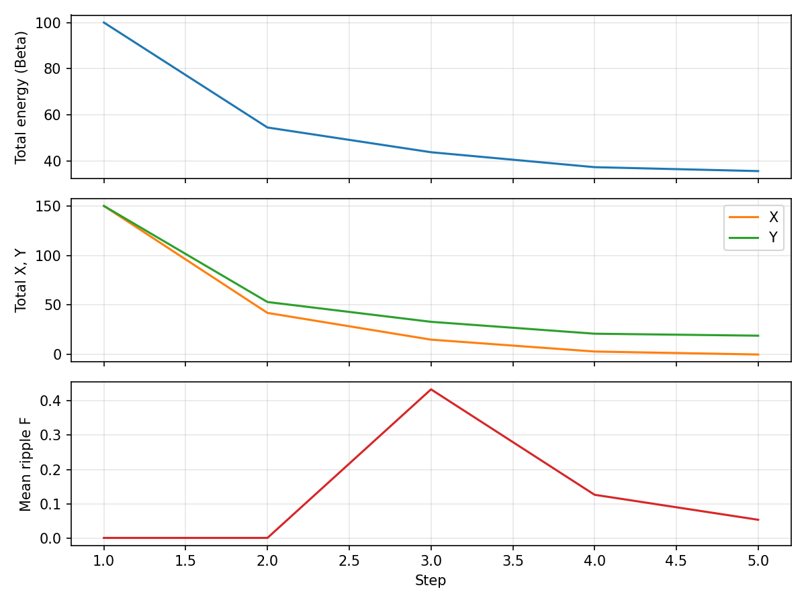
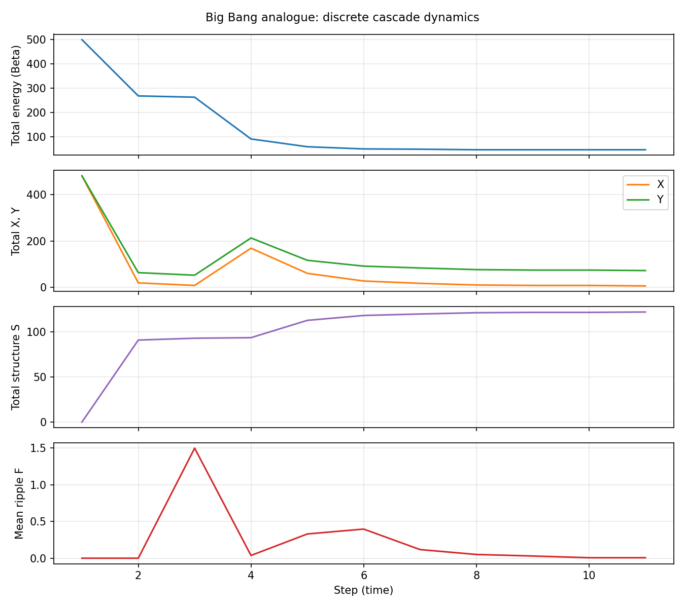
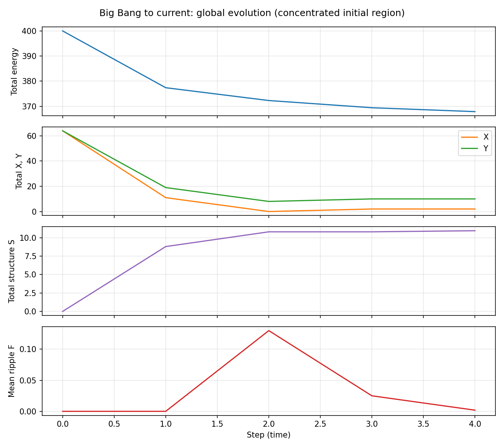
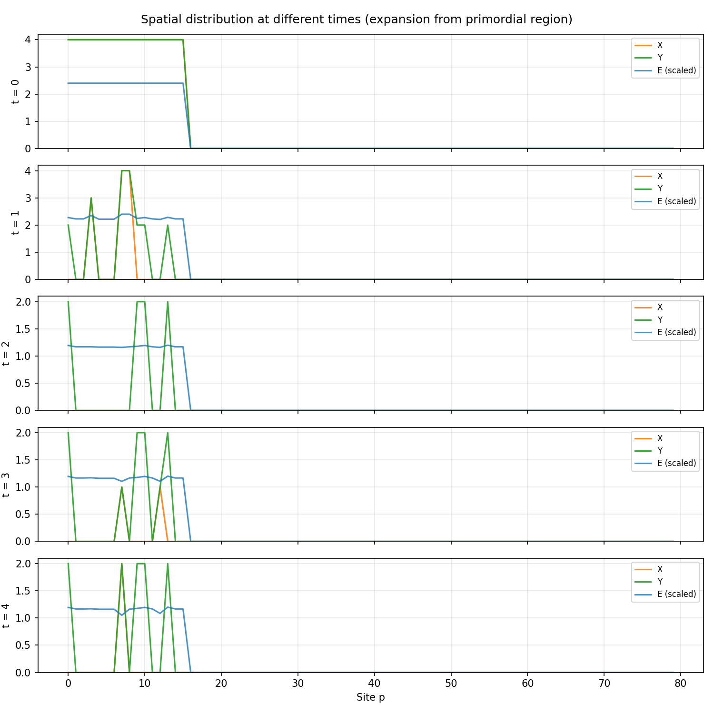
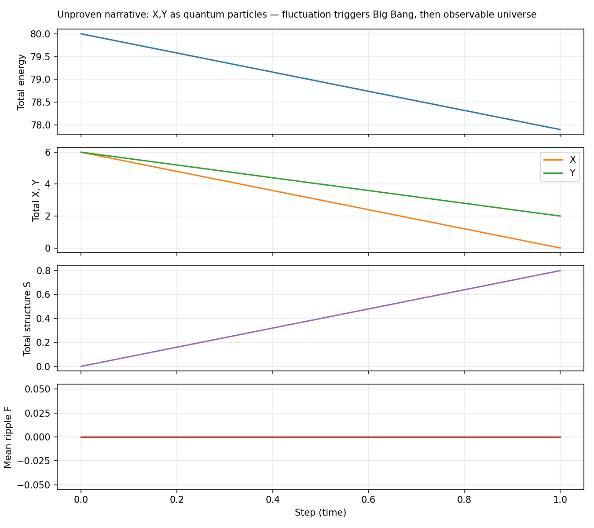
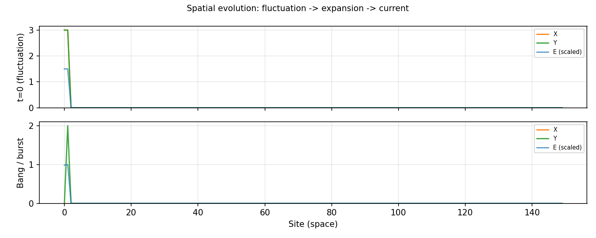
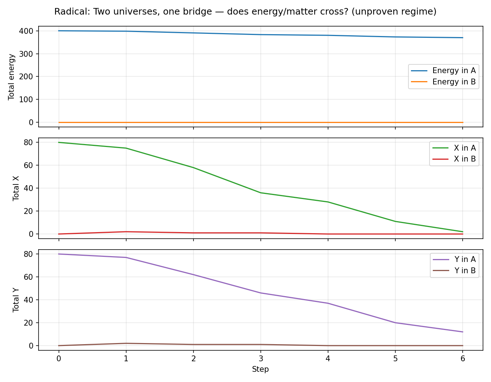

# Discrete cascade model

Discrete stochastic cascade dynamics on finite graphs with irreversible energy depletion: model specification, derivations, and Python simulations.

**Papers** (arXiv/manuscript): *Discrete Stochastic Cascade Dynamics on Finite Graphs with Irreversible Energy Depletion* (Paper I); *Necessity of Species Asymmetry for Structural Hierarchy in Discrete Stochastic Cascade Models* (Paper II). Source for the papers is not included here.

## Contents

- **[mathematical_model.txt](mathematical_model.txt)** — Full model specification (Sections I–XIV): state, dynamics, ripple rule, regimes, key equations, and derivations.
- **[model_simulation/](model_simulation/)** — Python implementation and run scripts. See that folder’s [README](model_simulation/README.md) for usage.
- **[figures/](figures/)** — Instructions to regenerate figures; see `figures/README.txt`.

## Figures

Generated by the simulation scripts (see `figures/README.txt`).

**Diagnostics (standard run)** — total energy, X/Y counts, mean ripple F.



**Big Bang analogue** — hot dense initial conditions; energy and species evolution.



**Cosmology run** — early-universe to “current” analogue: time series and spatial snapshots.





**Quantum-bang narrative** — fluctuation-triggered expansion; time series and snapshots.





**Radical run** — two “universes” connected by one bridge; mass in one side.



## Quick start

```bash
pip install -r model_simulation/requirements.txt
cd model_simulation
python run_simulation.py
```

Requires Python 3 with `numpy` and `matplotlib`.
