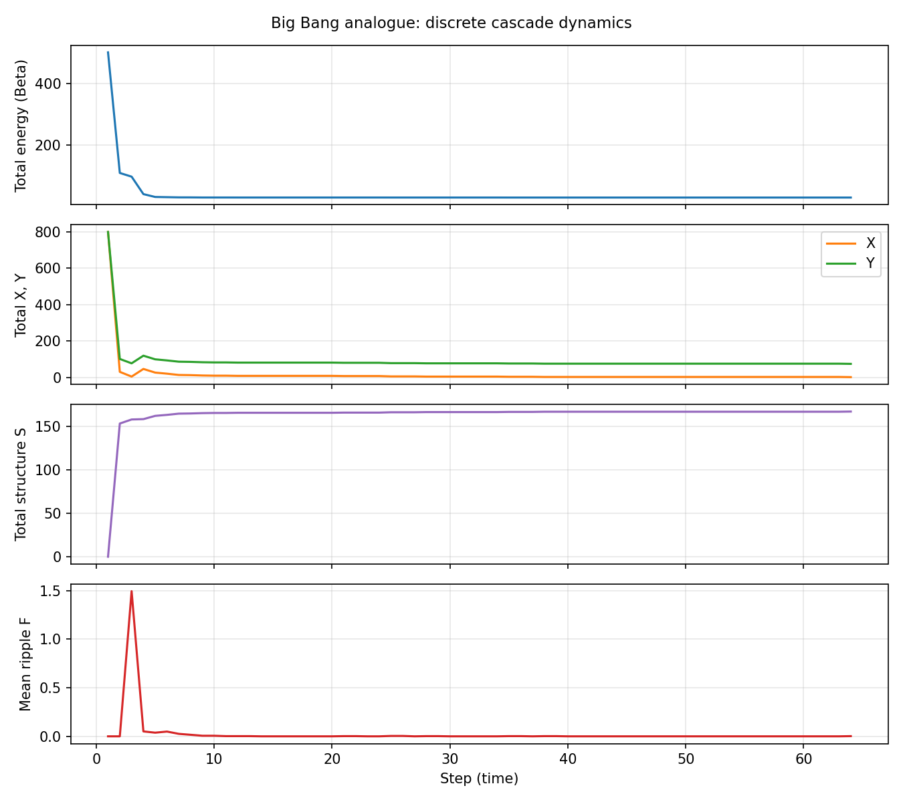
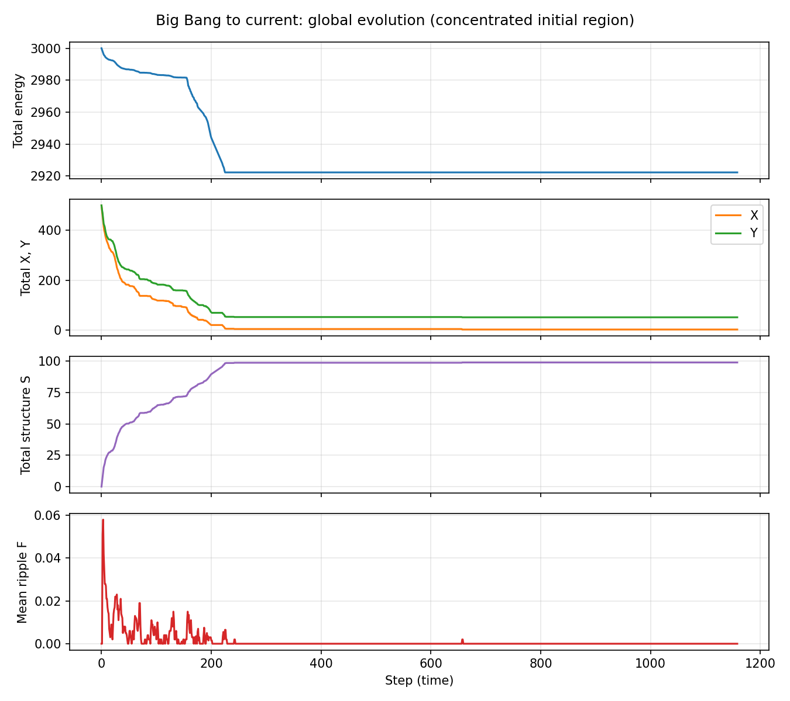
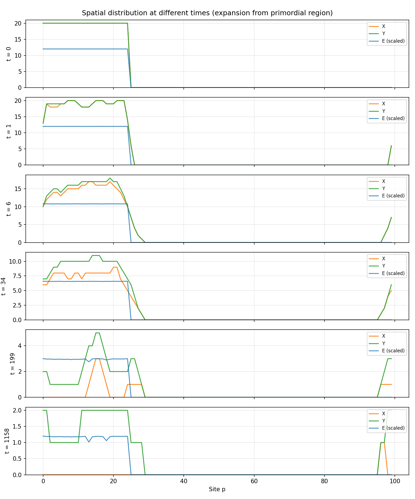
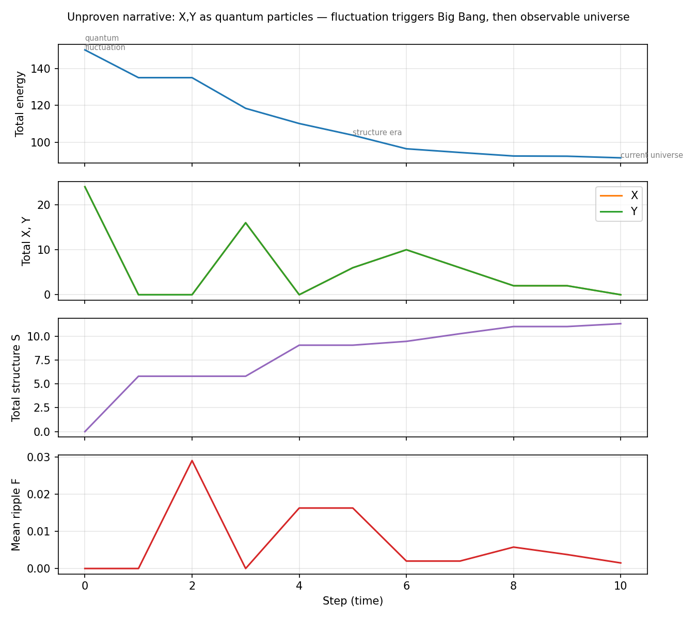
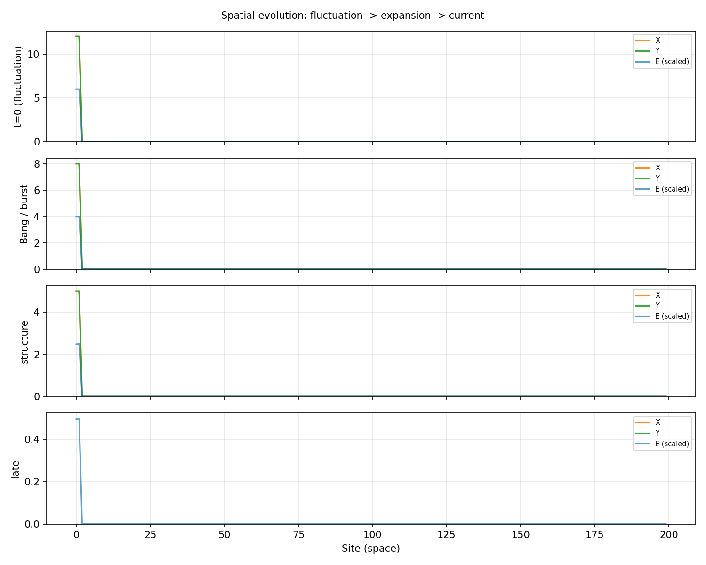
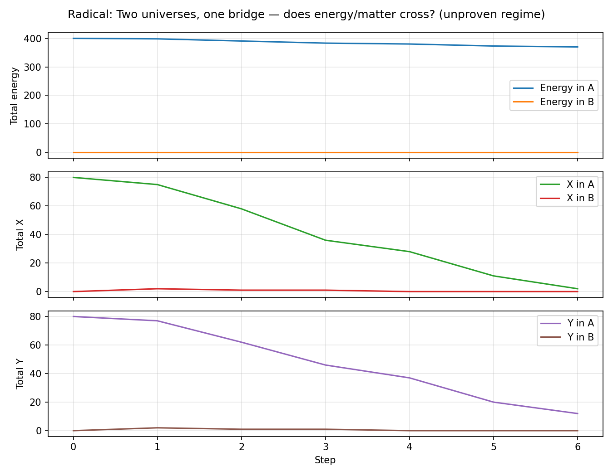

# Discrete Stochastic Cascade Dynamics on Finite Graphs

A new class of discrete dynamical systems with irreversible energy depletion, emergent structural hierarchy, and guaranteed finite-time absorption.

**Two-part paper series:**
- **Part I**: Construction, Guarantees, and Phase Structure
- **Part II**: Necessity of Species Asymmetry for Structural Hierarchy

Author: Shiv Goswami | [shivgoswami.com](https://shivgoswami.com)

---

## What this system is

A fully discrete stochastic process on a finite graph. No continuum limit, no external drive, no infinite resources. Two asymmetric excitation species (X, Y) interact and consume energy from a finite local field. The system couples four state variables through three dynamical regimes and terminates with probability one.

**Proven guarantees (Part I):**
- Energy decreases monotonically (supermartingale)
- Total activity is almost surely finite
- The system absorbs in finite time

**Proven necessity (Part II):**
- Species asymmetry is required for structural hierarchy
- The forbidden Y–Y channel is required for bond formation
- Frequency mismatch is required for non-trivial dynamics

## What the simulations reveal

The code in `model_simulation/` is not validation. It is an exploration surface for the formal system. Each run configuration exposes different regions of the dynamical landscape:

| Run | Regime explored | What to observe |
|-----|----------------|-----------------|
| `run_simulation.py` | Standard dynamics | Monotonic energy decay, three-regime transitions, absorption |
| `run_high_energy.py` | High-energy initial conditions | Explosive cascade onset, rapid pair creation, energy-driven termination |
| `run_spatial_concentration.py` | Spatially concentrated initial state | Wavefront propagation, spatial structure formation, local vs global depletion |
| `run_minimal_seed.py` | Fluctuation-triggered dynamics | Stochastic ignition from low-activity initial conditions, threshold sensitivity |
| `run_coupled_domains.py` | Topologically constrained graph | Bottleneck effects on cascade propagation, asymmetric spatial absorption |

**When you run these, observe:**
- Total energy $\mathcal{E}_{\text{tot}}$ always decreases (never recovers)
- X depletes faster than Y (asymmetric consumption from the forbidden Y–Y channel)
- Structural state $S$ rises during cascades, then freezes at absorption
- The final frozen configuration depends on stochastic history, not initial conditions alone

## Figures

Generated by the simulation scripts. Each figure is a diagnostic window into the system's behaviour.

**Standard run diagnostics**: energy, excitation counts, mean ripple


**High-energy regime**: explosive initial conditions, cascade dynamics



**Spatially concentrated initial state**: wavefront propagation and depletion





**Fluctuation-triggered dynamics**: stochastic ignition and cascade





**Topologically constrained graph**: two regions connected by a single bridge



## Repository structure

```
├── discrete_cascade_thesis.tex     Part I source (LaTeX)
├── asymmetry_necessity_paper2.tex  Part II source (LaTeX)
├── compiled_pdfs/                  Compiled PDFs (Part I, Part II)
├── model_simulation/               Python implementation and run scripts
│   ├── cascade_model.py            Core model class
│   ├── run_simulation.py           Standard dynamics
│   ├── run_high_energy.py           High-energy regime
│   ├── run_spatial_concentration.py Spatial concentration regime
│   ├── run_minimal_seed.py         Fluctuation-triggered regime
│   └── run_coupled_domains.py      Topological constraint regime
├── figures/                        Generated diagnostic figures
├── model_overview.txt              Compact model summary
└── mathematical_model.txt          Extended derivations
```

## Quick start

```bash
pip install -r model_simulation/requirements.txt
cd model_simulation
python run_simulation.py --plot
```

Requires Python 3 with `numpy` and `matplotlib`.
