# Discrete stochastic cascade model — full specification

Companion to `mathematical_model.txt` (Sections I–XIV). Tone matches `model_overview.txt`. Diagrams: **Mermaid** (neutral theme) plus **text** fallbacks. Figures are PNGs under `figures/`.

---

## Quick map (one-pager compression)

| Piece | Meaning |
|-------|---------|
| X, Y | Activity at a site (two species; Y–Y forbidden) |
| β (Beta) | Fuel — finite capacity energy, only decreases |
| S | Structure / memory of interactions and bonds |
| F | Ripple — how sharply S changes in time |
| One invariant | Total β always decreases until freeze |

**State at one site**

```text
  Site p (one vertex)
    graph embedding  ->  X, Y interact  ->  beta (fuel)  ->  S (structure / bonds)
```

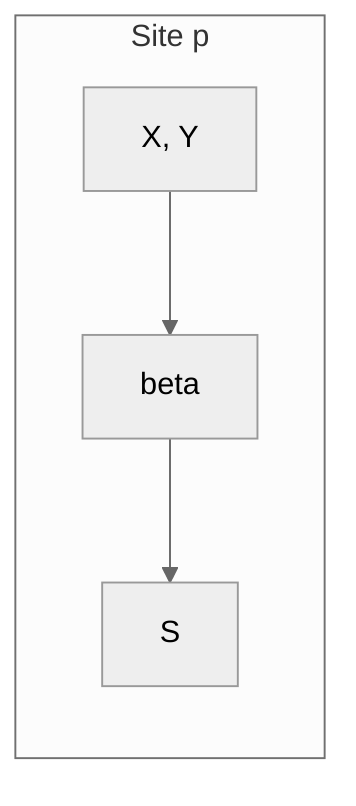

---

# I. Core variables

**Space:** discrete points `p` on a graph. **Time:** discrete step `n`.

**State at each site:**

| Symbol | Role |
|--------|------|
| \(X(p,n)\) | X excitation count (non-negative integer) |
| \(Y(p,n)\) | Y excitation count |
| \(\mathcal{E}(p,n)\) or β | Local capacity energy (≥ 0) |
| \(S(p,n)\) | Structural state (can encode bonds) |

**Global constants:** \(k\) (energy cost per XY interaction), \(C\) (ripple threshold), \(\Delta\) (overshoot margin), \(\lambda\) (leakage rate), \(\mu\) (bond rate), \(\alpha\) (interaction coefficient).

**One time step**

```text
  interact -> ripple F -> regime -> bonds -> beta down -> S update -> diffuse
  (XY,XX)     |d2 S|     leak/      Landau    spend fuel   memory     X,Y along
              at p       explode    bonding
```

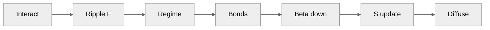

---

# II. Interaction layer (stochastic)

XY interactions are random. Expected interaction rate at site \(p\):

\[
R_{XY}(p,n) = \alpha \cdot X(p,n) \cdot Y(p,n)
\]

The realized count \(N_{XY}(p,n)\) is stochastic with mean \(R_{XY}\) (e.g. Poisson, capped by \(\min(X,Y)\)).

**Interaction funnel**

```text
  X, Y  -->  R_XY = alpha * X * Y  -->  N_XY (random)  -->  k * N_XY from beta
```

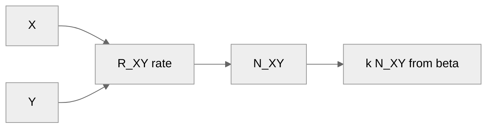

---

# III. Beta release rule

Each XY interaction consumes capacity energy:

\[
\Delta \mathcal{E}_{\text{release}}(p,n) = k \cdot N_{XY}(p,n)
\]

Single-site update (leakage \(L\) from Section V):

\[
\mathcal{E}(p,n+1) = \mathcal{E}(p,n) - k \cdot N_{XY}(p,n) - L(p,n) - \text{(explosion cost)} - \text{(bond cost)}
\]

**Total β strictly decreases** whenever the system is active:

\[
\sum_p \mathcal{E}(p,n+1) < \sum_p \mathcal{E}(p,n)
\]

Irreversible.

---

# IV. Ripple frequency (gamma measure)

Ripple intensity = discrete **second difference** of \(S\) in time:

\[
F(p,n) = \bigl| S(p,n) - 2S(p,n-1) + S(p,n-2) \bigr| = |\Delta^2 S|
\]

This measures how sharply \(S\) is curving in time (oscillatory intensity).

**Timeline (three ticks → one scalar F)**

```text
  n-2        n-1         n
  S(n-2) --> S(n-1) --> S(n)     ==>     F = |S(n) - 2S(n-1) + S(n-2)|
```

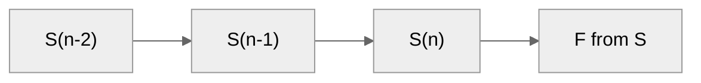

---

# V. Leakage vs explosion regime

**Ripple F: three regimes (low → high)**

```text
  0 ---- C ---- C+Delta ---->
  |  quiescent | leakage   | explosion |
  |  F <= C    | C<F<C+D   | F >= C+D  |
```

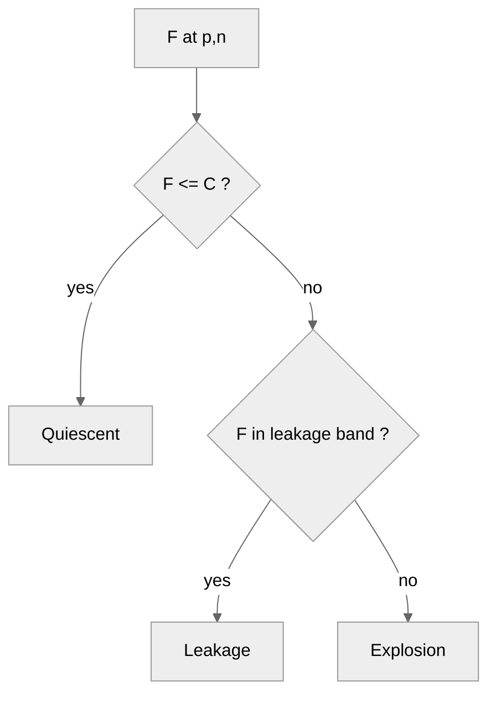

- If \(C < F(p,n) < C + \Delta\): slow leakage \(L(p,n) = \lambda \cdot F(p,n)\).
- If \(F(p,n) \geq C + \Delta\): explosion — create new XY pairs, consume additional β; local excitation density rises.

---

# VI. Bond formation

\[
B(p,n) = \mu \cdot X(p,n) \cdot Y(p,n)
\]

Bond formation: reduces free X and Y, writes composite state into \(S\), consumes β; bonds obey the same ripple + β rules; bonds are metastable.

---

# VII. Structural evolution (S update)

\[
S(p,n+1) = S(p,n) + \gamma_1 N_{XY}(p,n) + \gamma_{XX} N_{XX}(p,n) + \gamma_2 B(p,n)
\]

Ripple \(F\) emerges from how \(S\) evolves over time.

---

# VIII. Macroscopic consequences

Because β decreases, interaction rate \(\propto X\cdot Y\), ripple and explosions decay, excitations drain:

\[
F_{\text{avg}}(n+1) < F_{\text{avg}}(n)
\]

Eventually \(\mathcal{E} \to 0\), \(X,Y \to 0\), \(F \to 0\): **absorbing frozen state**. Final configuration = random residue of the last cascade.

**Figure — standard run (diagnostics):**

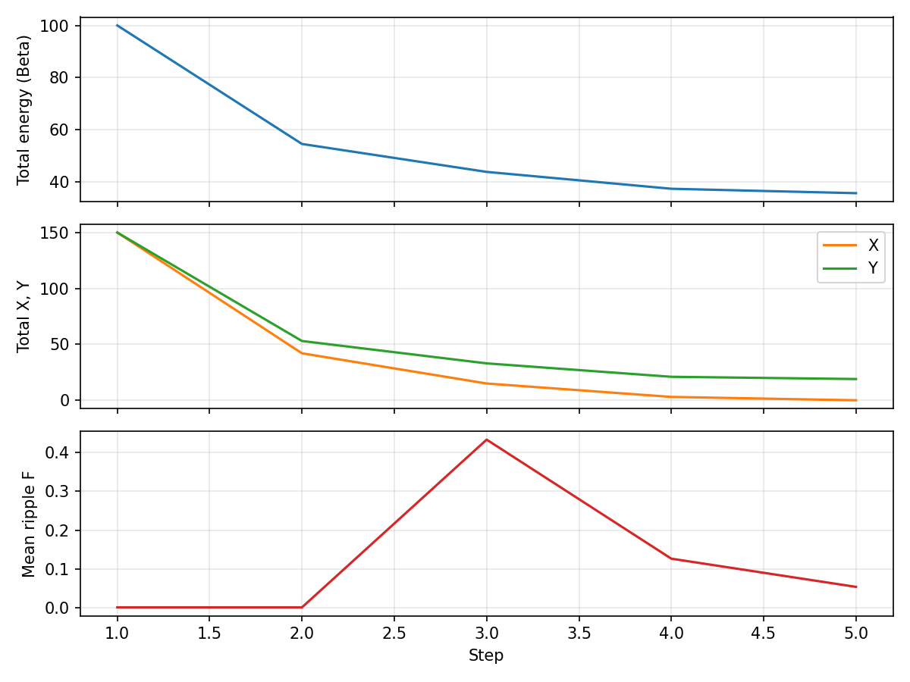

---

# IX. Interpretation of layers

| Layer | Role |
|-------|------|
| 1 — Micro field | Stochastic XY (and XX) interactions |
| 2 — Energy | β consumed per interaction; irreversible depletion |
| 3 — Instability | Ripple threshold picks leakage vs explosion |
| 4 — Structure | Pair creation and bonding build transient clumps |
| 5 — Thermodynamic arrow | Monotonic β decrease → cooling |

**Five layers (bottom = first in the logical story)**

```text
  5  thermodynamic arrow  (beta to zero, freeze)
  4  structure             (bonds, clumps in S)
  3  instability           (F chooses regime)
  2  energy                 (beta spent each event)
  1  micro field            (stochastic XY / XX)
```

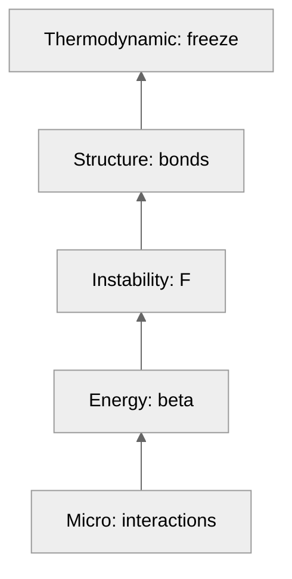

---

# X. Global invariant

Only strict global invariant:

\[
\sum_p \mathcal{E}(p,n+1) < \sum_p \mathcal{E}(p,n)
\]

whenever the system is active. Monotonic decay. Everything else is emergent.

---

# XI. Final summary of the discussion

**Starting point:** discomfort with infinite subdivision in continuum calculus.

**Replacement:** discrete layered dynamics on a graph.

**Built in:**

- Two asymmetric excitation families (X and Y)
- Random XY interactions; finite capacity β
- Ripple-based thresholds; leakage and explosive regimes
- Pair creation and bond formation
- Irreversible global depletion → cooling toward an absorbing frozen state
- Final state keeps stochastic memory of the last cascade

**What this is:** a discrete nonlinear stochastic cascade model with finite resource and absorbing equilibrium — internally consistent, layered, thermodynamically directed. Not a replacement for calculus; not yet fundamental physics; a structured toy cosmology.

---

# XII. Derivations and key equations

Notation: \(p\) = site, \(n\) = step; quantities non-negative unless stated.

### 12.1 Interaction rate

\[
R_{XY}(p,n) = \alpha \cdot X(p,n) \cdot Y(p,n)
\]

### 12.2 Beta update

\[
\mathcal{E}(p,n+1) = \mathcal{E}(p,n) - k N_{XY}(p,n) - L(p,n) - M(p,n) - \kappa B(p,n)
\]

with leakage in the band \(C < F < C+\Delta\), explosion cost \(M\), bond cost \(\kappa B\). Clamp \(\mathcal{E} \geq 0\).

### 12.3 Explosion count

Overshoot \(O = F - C\) when \(F \geq C+\Delta\):

\[
m(p,n) = \left\lfloor \frac{F(p,n)-C}{\Delta} \right\rfloor
\]

Energy \(M = \eta \cdot m\); cap \(m\) if β is insufficient.

### 12.4 Ripple

\[
F(p,n) = \bigl| S(p,n) - 2S(p,n-1) + S(p,n-2) \bigr|
\]

### 12.5 Structural update (with XX)

\[
S(p,n+1) = S(p,n) + \gamma_1 N_{XY} + \gamma_{XX} N_{XX} + \gamma_2 B
\]

### 12.6 Why total β strictly decreases (derivation)

At each step, \(D(n) \geq 0\). If any site has an XY interaction, or leakage (\(F\) in \((C, C+\Delta)\)), or explosion (\(F \geq C+\Delta\)), or bond formation, then \(D(n) > 0\). So \(\sum_p \mathcal{E}(p,n+1) = \sum_p \mathcal{E}(p,n) - D(n) < \sum_p \mathcal{E}(p,n)\) whenever the system is active. With finite initial total β, \(D(n)\) is bounded below by a positive amount (in expectation) until activity stops; hence after finitely many steps the system must reach a configuration where no further interactions, leakage, explosions, or bonds occur — the absorbing state.

### 12.7 Why \(F_{\text{avg}}\) eventually decreases (heuristic)

As total β falls, total activity (sum of \(N_{XY}\), explosions, bonds) must eventually fall. So increments to \(S\) become smaller and less frequent. The discrete second difference \(F = |\Delta^2 S|\) is driven by those increments; as they shrink and smooth out, \(F\) tends to decrease. Thus \(F_{\text{avg}}(n+1) < F_{\text{avg}}(n)\) in the long run, until \(F \leq C\) everywhere and the system is quiescent.

### 12.8 Bond formation

\[
B(p,n) \leq \min\left( \mu XY,\ \lfloor \mathcal{E}/\kappa \rfloor,\ X,\ Y \right)
\]

Optional Landau-style order–disorder condition on local order parameter.

### 12.9 Finite activity bound

With \(E_0 = \sum_p \mathcal{E}(p,0)\), total events \(\lesssim E_0 / \min(k,\eta,\kappa)\) ⇒ absorption in finite time a.s.

### 12.10 Key equations (boxed summary)

| Item | Equation |
|------|----------|
| Interaction rate | \(R_{XY} = \alpha XY\) |
| Ripple | \(F = \|S(n)-2S(n-1)+S(n-2)\|\) |
| Leakage | \(L = \lambda F\) when \(C < F < C+\Delta\) |
| Explosion pairs | \(m = \lfloor(F-C)/\Delta\rfloor\) when \(F \geq C+\Delta\) |
| β update | \(\mathcal{E}_{n+1} = \mathcal{E}_n - kN_{XY} - L - M - \kappa B\) |
| S update | \(S_{n+1} = S_n + \gamma_1 N_{XY} + \gamma_{XX} N_{XX} + \gamma_2 B\) |
| Global | \(\sum_p \mathcal{E}(p,n+1) \leq \sum_p \mathcal{E}(p,n)\), strict when active |

**Figure — Big Bang analogue (hot dense start):**

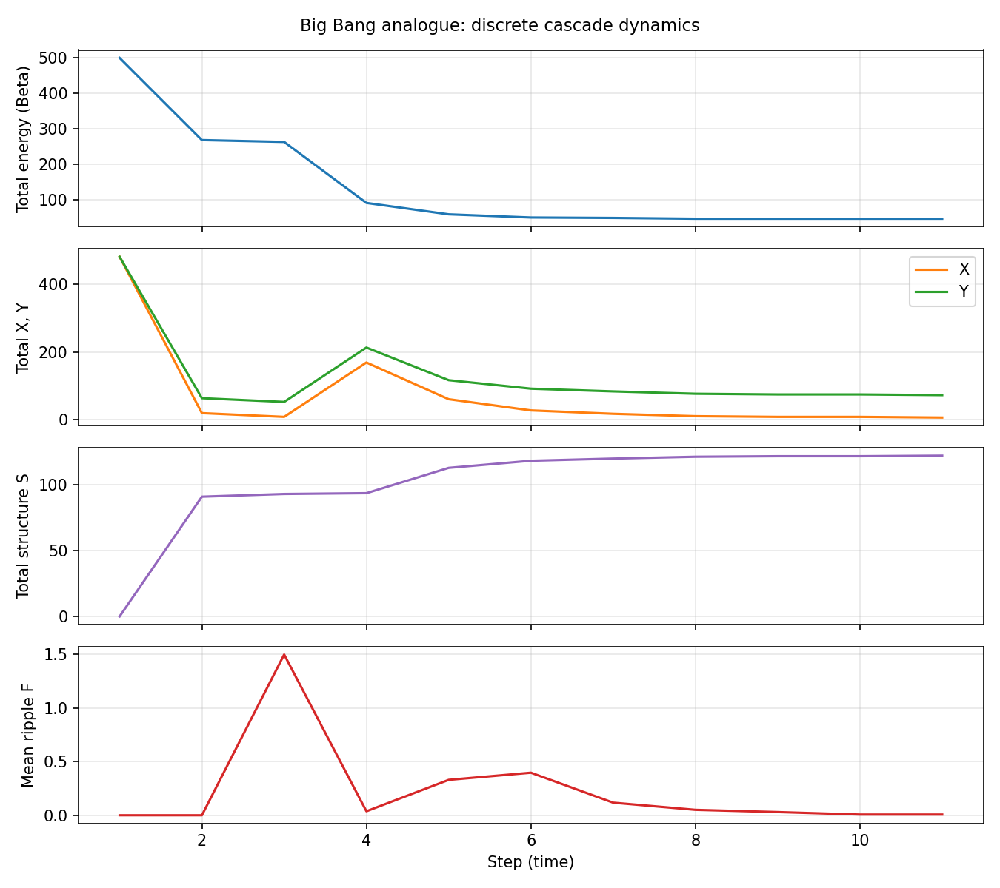

---

# XIII. Relevance to cosmology research

**Symmetry and asymmetry as two sides of one coin.** The same dynamics give both: (i) a unified formalism (same rules for X and Y where symmetric) and (ii) built-in asymmetries (Y–Y forbidden, \(\omega_X \neq \omega_Y\)) that theorems show are necessary. They are complementary, not opposed.

**(1) Asymmetry as principle** — analogues to matter–antimatter / sector asymmetry; here asymmetry can be *necessary* for structure.

**(2) Irreversibility and arrow of time** — total β decreases; toy arrow from discrete stochastic rules.

**(3) Structure from simple rules** — \(S\) and \(F\) from local rules and finite budget; conceptual link to structure formation narratives.

**(4) Runnable Big Bang analogue** — simulations show burst → structure → decay toward absorption.

The model does not describe real cosmology; it adds value as a controlled, simulatable reference.

**Figures — cosmology run (time series + spatial snapshots):**

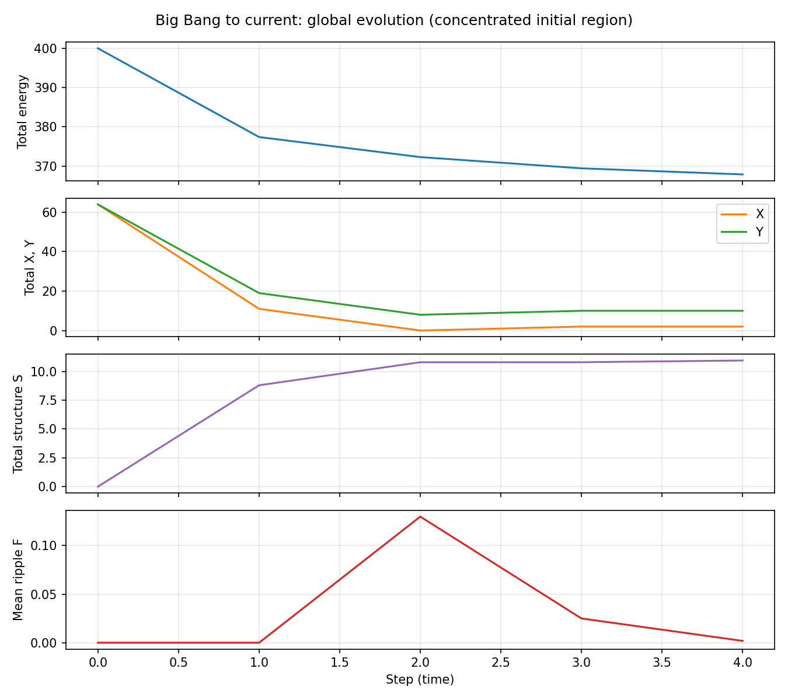

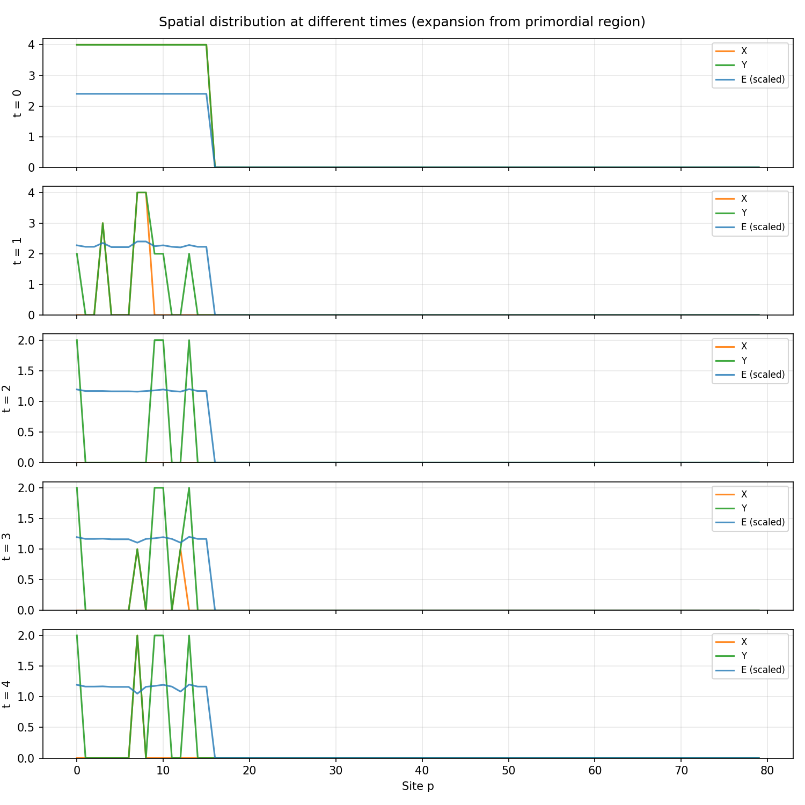

---

# XIV. Ripple rule, dimension-independence, model as whole system

### 14.1 Ripple rule — why it matters

**Definition:** \(F(p,n) = |\Delta^2 S|\) — discrete second difference of \(S\) in time.

**Role:** Turns recent history of \(S\) into one number that drives regimes: \(F \leq C\) quiescent; \(C < F < C+\Delta\) leakage; \(F \geq C+\Delta\) explosion.

**Why significant:**

- Discrete ⇒ well-defined on a finite graph; no continuum required.
- In Paper II, \(\omega_X \neq \omega_Y\) is necessary because the mismatch creates a *beat* in increments to \(S\); \(F = |\Delta^2 S|\) detects it. Without oscillation in increments, \(F \to 0\) and cascades die — frequency asymmetry matters *through* ripple.
- **Dimension-independent:** \(F\) uses *time* differences at fixed \(p\); the graph can be 1D, 2D, 3D, or abstract.

### 14.2 Model M as one system: space(M), time(M), dimension(M)

| Inside M | Meaning |
|------------|---------|
| **Space(M)** | Graph \(\mathcal{G}\): sites \(p\), edges, diffusion |
| **Time(M)** | Step index \(n\); no external clock |
| **Dimension(M)** | How the graph is embedded (1D chain, lattice, …); same update rules at any dimension |

Ripple uses only temporal history of \(S\) at each site, so it attaches to M the same way in any spatial dimension.

**Figures — quantum-fluctuation narrative run:**

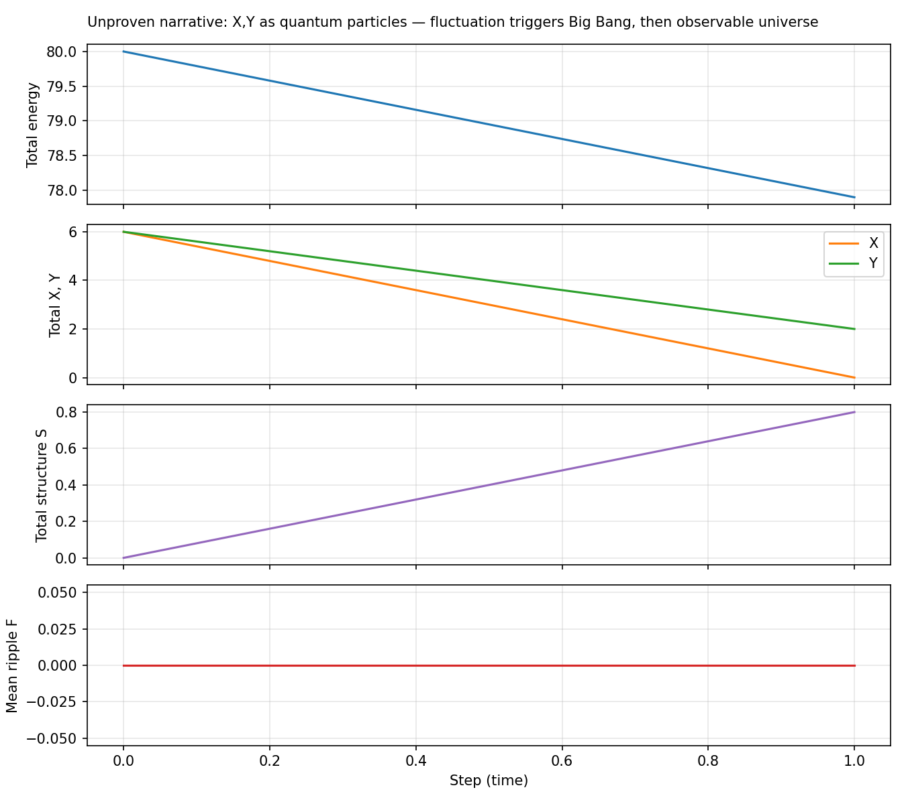

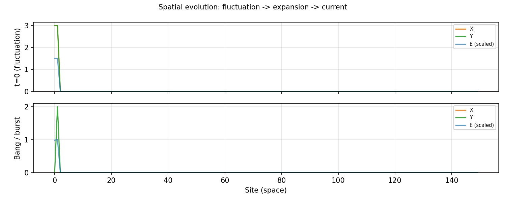

---

## End note

This file mirrors `mathematical_model.txt` (Sections I–XIV). For a short public overview see `model_overview.txt`; for code see `model_simulation/README.md`.
